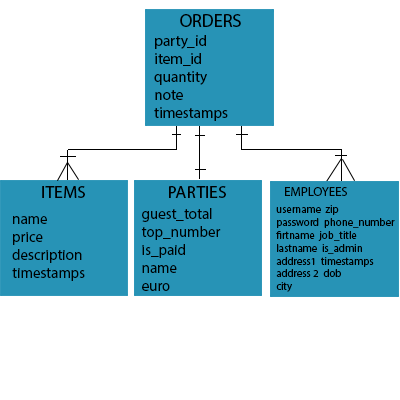

###Ruby version
 Ruby 2.2.3p173 (2015-08-18 revision 51636) [x86_64-darwin15]

###System dependencies
* Postgresql
* SCSS
* Uglifier
* Foundation Rails
* JQuery Rails
* Turbo Links
* JBuilder
* Sdoc
* Bcrypt
* Byebug
* Web Console
* Pry Rails
* Awesome Print
* Spring

###Database creation
The application uses four databases which include employees, menu items, orders, and parties. The employees table uses an isAdmin column to grant administrator status. Admins can add/remove both employees and menu items.

  

###Database initialization

###How to run the test suite

###Services (job queues, cache servers, search engines, etc.)

###Deployment instructions
1.     Pull the project down from GitHub using git clone 
2.     Change into the project directory using cd [project_name] 
3.     Install the gems using bundle install 
4.     Create the database rake db:create 
5.     Run the migrations rake db:migrate 
